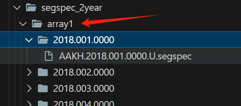

# 使用说明

## 一、命令行配置参数

示例：
```shell
/home/woodwood/hpc/Resources/FastXC-wood/xc-0.9.0/bin/spec_xc_dual -A /home/woodwood/hpc/station_2/z-test/specList_2year_0.9.4_sort/specList_array1.txt -B /home/woodwood/hpc/station_2/z-test/specList_2year_0.9.4_sort/specList_array2.txt -O /home/woodwood/hpc/station_2/z-test/stack_test_2year_sort/ncf -S /home/woodwood/hpc/station_2/z-test/stack_test_2year_sort -C 500
```
1. spec_xc_dual：可执行文件路径
2. -A：segspecList文件1路径
3. -B：segspecList文件2路径
4. -O：互相关结果文件路径
5. -S：叠加结果文件夹路径
6. -C：

## 二、read_segspec.c
其中包含以下函数：
```c
int readMergedSpecBuffer_onlyOneHead_mmap(const char *filename, complex *spec_buffer, size_t buffer_size);

void readMergedSpecBuffer_onlyOneHead(const char *filename, complex *spec_buffer, size_t buffer_size);

int readMergedSpec_head(const char *filename, SEGSPEC *spec_head);

void writeFileNum(FILE *file, int fileCount);

int mergeFiles_onlyOneHead(const char *baseDir, FILE *outputFile, int *firstFile);

void readFilesConcurrently(const char* file1, complex* buffer1, size_t size1, const char* file2, complex* buffer2, size_t size2);
```
其中：
1. `readMergedSpecBuffer_onlyOneHead_mmap`：使用mmap内存映射读取合并文件的数据区到 spec_buffer, 理论上读取定长文件速度会更快，但实际测试中发现速度差不多。

2. `readMergedSpecBuffer_onlyOneHead`：简单地使用fread读取合并文件的数据区到 spec_buffer，测试发现与mmap速度差不多。

3. `readMergedSpec_head`：读取合并文件的头部信息到 spec_head，即读取 SEGSPEC 头。

4. `writeFileNum`：将文件数量写入文件。

5. `mergeFiles_onlyOneHead`：合并文件，合并后的文件只有一个 SEGSPEC 头，多个数据区。其中参数 baseDir 指定到 array 这一级，例如：


6. readFilesConcurrently：两个线程读取两个合并文件的数据区到两个 buffer，理论上来说在 RAID 阵列上可以提高读取速度。

## 三、read_mutiple_sac.c
主要是需要使用到 `read_and_writeout_multiple_sac` 函数，该函数可以读取写出的互相关结果合并大文件，然后将结果还原出来，还原为多个 sac 文件。
